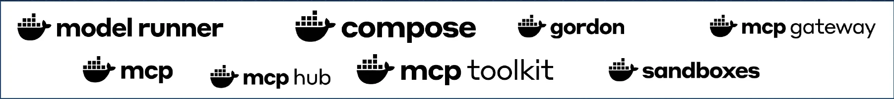

<!--
layout: image
image: assets/slide-01.webp
alt: "Docker does that?! - Five Docker capabilities you may not know about. WeAreDevelopers 2026."
chrome: false
-->

Note: Title. "Docker does that?!" - five Docker capabilities you may not know
about. WeAreDevelopers 2026.

---

<!--
layout: image
image: assets/slide-02.webp
alt: "Meet your speakers - Kristiyan Velkov and Ajeet Singh Raina."
chrome: false
-->

Note: Meet your speakers - Kristiyan Velkov (Docker Captain) and Ajeet Singh Raina
(Developer Advocate).

---

<!--
layout: default
-->

Docker isn't just a container company anymore.

:::fragment

It's an AI company!

:::

Note: The one-line thesis of this talk - Docker isn't just a container company
anymore, it's an AI company, building the platform to build, run, and ship agents
securely. Everything that follows is proof.

---

<!--
layout: split
-->

<!-- region -->

## THEN

:::fragment

Docker Hub meant one thing - **millions of container images**.

:::

<!-- region -->

## NOW

:::fragment

Docker provides tools for working with AI across your development workflow.

<ul class="hubchecklist">
<li>Images</li>
<li>Helm Charts</li>
<li>Sandbox Kits</li>
<li>AI Models</li>
<li>Compose</li>
<li>Extensions</li>
<li>Plugins</li>
</ul>

:::

Note: Then and now. For years Docker Hub meant one thing - millions of container
images, every database, language, and framework. Not anymore: Docker Hub now hosts
Images, Helm Charts, Sandbox Kits, AI Models, Compose, Extensions, and Plugins. It
is not just a software stack anymore, it is an agentic stack too. (Builds: THEN
first, then NOW.)

---

<!--
layout: image
image: assets/slide-03.webp
alt: "Agenda - Gordon, Testcontainers, Docker Scout, Hardened Images, Sandboxes."
chrome: false
-->

Note: Agenda - the five capabilities: Gordon, Testcontainers, Docker Scout,
Hardened Images, and Sandboxes.

---

<!--
layout: image
image: assets/slide-04.webp
alt: "Docker Platform - build, run, and share software. Securely. Local and Cloud."
chrome: false
-->

Note: The Docker Platform - build, run, and share software, securely, across local
and cloud.

---

<!--
layout: image
image: assets/slide-05.webp
alt: "Docker AI Platform - build, run, and share AI agents. Securely. Local and Cloud."
chrome: false
-->

Note: The Docker AI Platform - build, run, and share AI agents, securely, across
local and cloud.

---

<!--
layout: default
-->

THE PLAN

# One developer - Max. One morning. Five surprises.

09:00

Gordon

AI assistant for Docker developers

09:45

Testcontainers

A real DB in your tests

10:30

Docker Scout

Base images arrive patched

11:15

Hardened Images

Know what's inside. Enforce policy

12:00

Sandboxes

Pair with an AI agent safely

Note: The plan - one developer, Max. One morning. Five surprises, from 09:00
through 12:00: Gordon, Testcontainers, Docker Scout, Hardened Images, Sandboxes.

---

<!--
layout: image
image: assets/slide-08.webp
alt: "Task - Max has been asked to containerize the Product Catalog sample app, following best practices."
chrome: false
-->

Note: The task - Max has been asked to containerize the Product Catalog sample app,
following the best practices.

---

<!--
layout: image
image: assets/slide-09.webp
alt: "Section transition into Max's morning."
chrome: false
-->

Note: Transition into Max's morning.
