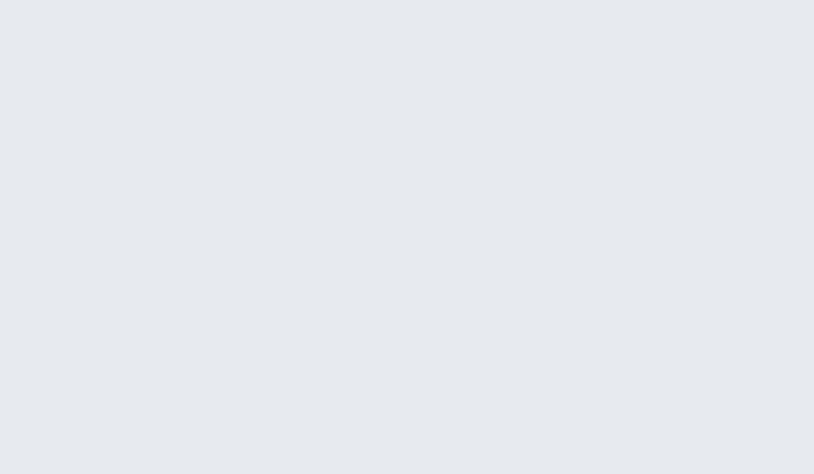

<!--
layout: section
eyebrow: "11:15 — before you push"
-->

# "What's actually inside this image?"

And does it meet the bar our security team set?

Note: Image built. Before you push it, the honest question: what's in it, and is it
allowed to ship? Most of us have no fast way to answer that.

---

# The problem

:::card{label="Black box" accent=red variant=fill}
An image is layers of software from many sources. Which packages? Which CVEs? Does
it violate a policy — no root, no critical CVEs, must have an SBOM? You usually find
out **after** it ships.
:::

Note: An image is a black box of software from many sources. Usually you learn the
answer in production, from someone else, badly.

---

# Docker **Scout**

Look inside any image — from the CLI or Docker Desktop — and turn "hope it's fine"
into a **policy check**.

- `quickview` — instant health summary
- `cves` — full vulnerability breakdown + SBOM
- `recommendations` — a safer base/tag to move to
- **Policy evaluation** — pass/fail against your org's rules, locally and in CI

Note: Scout answers the question. quickview for a fast read, cves for the full list
with an SBOM, recommendations for the better base, and policy evaluation so "meets
the bar" is a pass/fail, not a vibe.

---

# From "what's in it" to "does it pass"

```bash
$ docker scout quickview my-app:latest
  Critical  0   High  2   Medium  14   Low  31

$ docker scout recommendations my-app:latest
  ↳ base image node:20  →  node:20-slim   (removes 41 CVEs)

$ docker scout policy my-app:latest        # pass / fail in CI
  ✗ No high or critical vulnerabilities   FAILED (2 high)
  ✓ Supply chain attestations present     PASSED
```



:::card{label="Takeaway" accent=blue variant=fill}
Know exactly what you ship — and **gate it on policy** before it ever leaves your
laptop.
:::

Note: Four commands, whole story: health, CVEs, what to move to, and does it pass.
That last one runs the same in CI. Pairs beautifully with Hardened Images.
